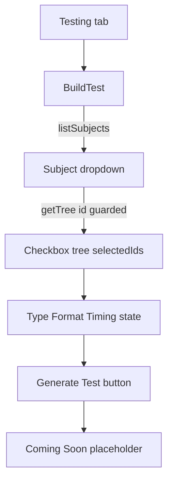

# Testing tab: Build Test workflow (UI-only)

## Scope confirmed

- Section 1 selects content within a **single** subject (pick subject first, then its tree).
- Tree is fetched lazily via existing `api.getTree(id)` when a subject is selected.
- No backend changes, no AI/test generation. Final button shows a Coming Soon placeholder only.
- **Tab lifecycle:** `{tab === "testing" && <BuildTest />}` unmounts on tab switch — all state is lost. Intentional for v1; not a bug.

## 1. Navigation: add the tab

In [frontend/src/components/ToolScreen.tsx](frontend/src/components/ToolScreen.tsx):

- Widen tab type: `type Tab = "subjects" | "testing" | "settings";`
- Add **Testing** tab button between Subjects and Settings (order: Subjects, Testing, Settings).
- Render `{tab === "testing" && <BuildTest />}`.

```tsx
<button className={tab === "testing" ? "active" : ""} onClick={() => setTab("testing")}>
  Testing
</button>
```

**Note:** `ToolScreen` already calls `api.listSubjects()` on mount. `BuildTest` will fetch again on its own mount (acceptable for v1; optional later: pass `subjects` as a prop to avoid duplicate request).

## 2. New component: `BuildTest.tsx`

Create [frontend/src/components/BuildTest.tsx](frontend/src/components/BuildTest.tsx). Uses `api.listSubjects()` and `api.getTree()` from [frontend/src/api.ts](frontend/src/api.ts), types from [frontend/src/types.ts](frontend/src/types.ts).

### Local state (in-memory only)

| State | Type | Notes |
|-------|------|-------|
| `subjects` | `SubjectSummary[]` | From `listSubjects` |
| `subjectsErr` / `loadingSubjects` | string / boolean | Match `Settings` / `TreeView` patterns |
| `subjectId` | `number \| null` | Selected subject |
| `tree` | `Tree \| null` | Loaded after subject pick |
| `treeErr` / `loadingTree` | string / boolean | |
| `selectedIds` | `Set<number>` | **Always clone on update** (`new Set(prev)`) |
| `testType` | `"frq" \| "mcq4" \| "mcq5" \| null` | |
| `format` | `"online" \| "print" \| null` | |
| `timing` | `"timed" \| "untimed"` | Default `"untimed"` |
| `timeLimit` | string | Minutes; `type="number" min="1"` when timed |
| `showComingSoon` | boolean | |

### Subject change: reset rules

When `subjectId` changes, reset **all** of:

- `selectedIds` → empty `Set`
- `tree` / `treeErr` → null / cleared
- `showComingSoon` → `false`
- `testType`, `format` → `null`
- `timing` → `"untimed"`, `timeLimit` → `""`

### Loading, error, and empty UI

Mirror existing patterns:

- **Subjects loading:** muted text (e.g. "Loading subjects…").
- **Subjects error:** `.error` card (like `TreeView`).
- **Empty list:** "No subjects yet. Upload a guide in the Subjects tab." (like `ToolScreen` subject list).
- **Tree loading:** "Loading blueprint…" while `getTree` runs.
- **Tree error:** `.error` card with message.
- **Stale fetch guard:** In the `getTree` effect, track requested `subjectId`; ignore responses if dropdown changed before resolve (or use an `aborted` flag in cleanup).

### Section 1 — Select Test Content

- Subject `<select>` at top of section.
- Once tree loads, render `tree.sections` as nested checkbox tree (reuse `.tree-node`, `.node-line`, `.node-title` from [frontend/src/styles.css](frontend/src/styles.css)).
- **Select all subject** row above sections: one checkbox that toggles every node ID in the tree (parent + all descendants). Matches "whole subject" affordance from `TreeView` downloads.

#### Which nodes are selectable?

- **All nodes** in the tree are selectable (sections and subheaders), including `excluded` and `deterministic`.
- Excluded nodes: show with existing `.excluded` opacity (same as `TreeView`) but remain checkable.
- Pre-approval subjects (`status === "uploaded"`): valid — tree exists; no card count requirement.
- Nodes with 0 cards: selectable; no de-emphasis beyond normal styling.

#### Checkbox selection rules (canonical)

**Storage model:** `selectedIds` is the source of truth. Toggling always adds/removes **that node's ID plus every descendant ID**.

**Display model (parent checkbox):**

- **Checked:** node ID is in `selectedIds` (implies all descendants are also in set after a parent toggle; if user toggled children individually, parent toggle-on adds parent + all descendants).
- **Indeterminate:** node ID is **not** in `selectedIds`, but **some** (not all) descendant IDs are in `selectedIds`.
- **Unchecked:** neither node nor any descendant in `selectedIds`.

**Count label:** `"N items selected"` = `selectedIds.size` (literal set size, not deduped by display).

**Implementation notes:**

- Indeterminate is not a React `checked` prop — set `input.indeterminate` in a `useEffect` (or callback ref) whenever `selectedIds` changes for each parent row.
- All `setSelectedIds` updates must clone: `setSelectedIds((prev) => { const next = new Set(prev); ...; return next; })`.

#### Section 2 — Select Test Type (single-select)

- Segmented buttons: **FRQ**, **MCQ (4 options)**, **MCQ (5 options)** → `frq | mcq4 | mcq5`.
- Only one active at a time (`.seg.active`).

#### Section 3 — Select Test Format (single-select)

- Segmented buttons: **Online**, **Print** → `format`.
- If **Online:** show Timed / Untimed segmented toggle. If **Timed:** number input "Time limit (minutes)" with `type="number" min="1"`.
- If **Print:** hide all timing UI (timing state ignored, not cleared).

#### Section 4 — Generate

- Button: **Generate Test** (`button.primary`), **always enabled** (even with 0 selections or incomplete config).
- On click: `showComingSoon = true`. Show placeholder card: "Coming soon — test generation is not available yet."
- Placeholder stays visible after first click (re-clicking does not toggle off). Only subject change resets it.

### Accessibility (first pass)

- Wrap checkbox + title in `<label>` or use `htmlFor` + `id`.
- Segmented controls: `aria-pressed={true/false}` on active segment.
- `.seg-group`: `flex-wrap: wrap` for narrow screens.

## 3. Styles

In [frontend/src/styles.css](frontend/src/styles.css):

- `.build-section` — section wrapper (can use `.card` + heading).
- `.seg-group` / `.seg` / `.seg.active` — single-select option buttons (mirror `.tabs` colors).
- `.coming-soon` — muted placeholder, dashed border.
- `.checkbox-tree` — optional wrapper; reuse `.tree-node` / `.node-line`.

## 4. Build

Run `npm run build` in `frontend/` (`tsc -b && vite build`) so `frontend/dist` serves the new tab.

## Data flow



## Manual test checklist

- [ ] Tab order: Subjects, Testing, Settings; Testing shows Build Test workflow.
- [ ] Empty subjects message when no uploads.
- [ ] Pick subject → tree loads; change subject quickly → no stale tree flash.
- [ ] Select all subject checkbox selects every node.
- [ ] Parent toggle selects parent + all children; parent indeterminate when some children checked.
- [ ] Excluded nodes visible (dimmed) and checkable.
- [ ] Section 2: only one test type at a time.
- [ ] Section 3: Print hides timing; Online + Timed shows minutes field.
- [ ] Generate Test → Coming Soon; switch subject → placeholder clears.
- [ ] Leave Testing tab and return → state cleared (fresh mount).
- [ ] `npm run build` succeeds.

## Out of scope

- AI generation, question creation, test-taking mode.
- Backend endpoints or persistence.
- Frontend unit tests (project has none in `package.json` today).
- Passing `subjects` from `ToolScreen` to avoid duplicate fetch (optional follow-up).
